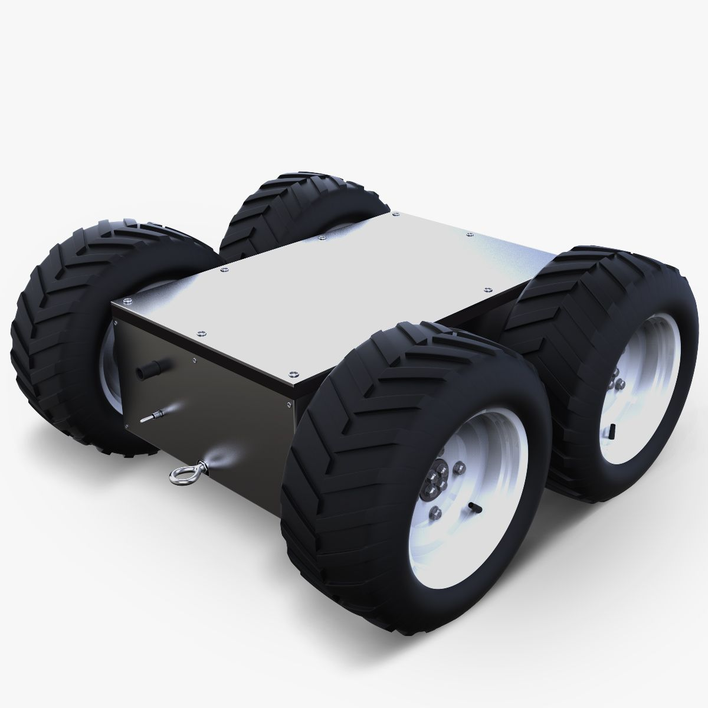

# SmartCart Standalone Simulation

A complete ROS 2 Jazzy + Gazebo Harmonic simulation of an autonomous smart shopping cart platform.



---

## 🚀 Features

- **Interactive Human Keyboard Teleop:** Control the simulated shopper anywhere around the supermarket using intuitive WASD / Arrow keys in real-time, with an interactive HUD.
- **Autonomous Human Following:** 4WD Skid-Steer SmartCart automatically follows behind the human in 3D space, smoothly turning, maintaining a safe ~1.2m following distance, and rotating on the spot when the human walks past or turns around.
- **4WD Skid-Steer UGV Architecture:** Heavy-duty chassis model with brushed aluminum deck, low center-of-mass, 7cm ground clearance, and 4 rugged all-terrain drive wheels (`gz::sim::systems::DiffDrive`).
- **Gazebo Supermarket World:** Complete supermarket aisle environment with perimeter walls, shelving units, checkout counters, and obstacle geometry.
- **LiDAR Obstacle Emergency Stop:** 2D Planar LiDAR (360 samples, 10 Hz) monitoring the ±30° front safety sector for automatic emergency stops within 0.60m.
- **Interactive RFID Item Scanner & Billing:** Autonomous RFID product lookup catalog (`Milk`, `Bread`, `Apple`, `Biscuit`), duplicate scan prevention, cart clearing, and live billing.

---

## 📁 Package Architecture

```
smartcart_ws/src/
├── smartcart_description/          # URDF / Xacro model and sensor definitions
│   └── urdf/smartcart.urdf.xacro   # 4WD Skid-steer model, LiDAR, Camera, DiffDrive plugin
├── smartcart_gazebo/               # Gazebo Harmonic world and launch files
│   ├── worlds/smartcart_world.sdf  # Supermarket world environment
│   ├── models/human/               # Collision-enabled human model
│   └── launch/smartcart.launch.py  # Integrated one-command simulation launch
└── smartcart_human/                # ROS 2 Python nodes
    ├── human_controller.py         # Updates human position in Gazebo and publishes /human/pose
    ├── human_teleop.py             # Interactive keyboard teleoperation with real-time HUD
    ├── follow_controller.py        # Proportional human-follow and LiDAR safety controller
    └── rfid_simulator.py           # Interactive RFID billing and product scanner
```

---

## 🛠️ Build & Installation

Ensure ROS 2 Jazzy and Gazebo Harmonic are installed:

```bash
cd ~/smartcart_simulation/smartcart_ws
source /opt/ros/jazzy/setup.bash
colcon build --symlink-install
source install/setup.bash
```

---

## 🎮 Running the Simulation

### 1. Launch Main Simulation (Gazebo + Human + Cart + Controllers)
```bash
source /opt/ros/jazzy/setup.bash
source ~/smartcart_simulation/smartcart_ws/install/setup.bash
ros2 launch smartcart_gazebo smartcart.launch.py
```
*(Optionally, start directly in manual mode with `ros2 launch smartcart_gazebo smartcart.launch.py human_mode:=manual`)*

### 2. Control Human with Keyboard (Separate Terminal)
```bash
source /opt/ros/jazzy/setup.bash
source ~/smartcart_simulation/smartcart_ws/install/setup.bash
ros2 run smartcart_human human_teleop
```

#### 🕹️ Keyboard Controls:
| Key | Action |
|---|---|
| `W` / `Up Arrow` | Walk Forward |
| `S` / `Down Arrow` | Walk Backward |
| `A` / `Left Arrow` | Turn Left (Yaw) |
| `D` / `Right Arrow` | Turn Right (Yaw) |
| `Q` / `E` | Strafe Left / Right |
| `Space` / `X` | Stop Human |
| `+` / `-` | Speed Up / Slow Down |
| `Ctrl+C` | Exit Teleop |

### 3. Launch RFID Item Scanner & Billing (Separate Terminal)
```bash
source /opt/ros/jazzy/setup.bash
source ~/smartcart_simulation/smartcart_ws/install/setup.bash
ros2 run smartcart_human rfid_simulator
```

---

## 📡 ROS 2 Topics & Interfaces

| Topic | Type | Description |
|---|---|---|
| `/cmd_vel` | `geometry_msgs/msg/Twist` | Robot velocity commands |
| `/scan` | `sensor_msgs/msg/LaserScan` | 2D Planar LiDAR sensor data |
| `/wheel/odometry` | `nav_msgs/msg/Odometry` | Wheel odometry and robot pose |
| `/human/pose` | `geometry_msgs/msg/Pose` | Simulated human position |
| `/human/cmd_vel` | `geometry_msgs/msg/Twist` | Manual keyboard teleoperation velocity commands |
| `/rfid/item` | `std_msgs/msg/String` | Scanned RFID item identifier |
| `/camera/image_raw` | `sensor_msgs/msg/Image` | Forward-facing camera feed |

---

## ✅ Full Acceptance Test Matrix (All 16 Tests Passing)

1. **Build:** All 3 packages build with `colcon build` (0 warnings, 0 errors).
2. **Spawn:** SmartCart spawns stably in Gazebo at $x=0, y=0, z=0.3$.
3. **Human:** Collision-enabled human model initialized and visible.
4. **Drive:** Responds smoothly to velocity commands on `/cmd_vel`.
5. **LiDAR:** 360-sample scan data published to `/scan` at 10 Hz.
6. **Human Pose:** Oscillates and publishes continuously to `/human/pose`.
7. **Follow:** Cart follows human smoothly when distance $> 1.2\text{ m}$.
8. **Turn:** Cart turns towards lateral human offset.
9. **Target Distance:** Cart stops forward motion at target distance ($\sim 1.2\text{ m}$).
10. **Obstacle Safety:** Emergency stop triggers when obstacle enters front sector $< 0.60\text{ m}$.
11. **Human Lost:** Stops safely within $1.0\text{ s}$ if human tracking signal is lost.
12. **RFID Known Item:** Resolves tag and adds item to cart.
13. **RFID Duplicate Protection:** Rejects duplicate scans and preserves total.
14. **RFID Unknown Tag:** Gracefully warns without crash.
15. **RFID Total Calculation:** Computes accurate running total.
16. **Shutdown Safety:** Publishes zero velocity on node termination.
