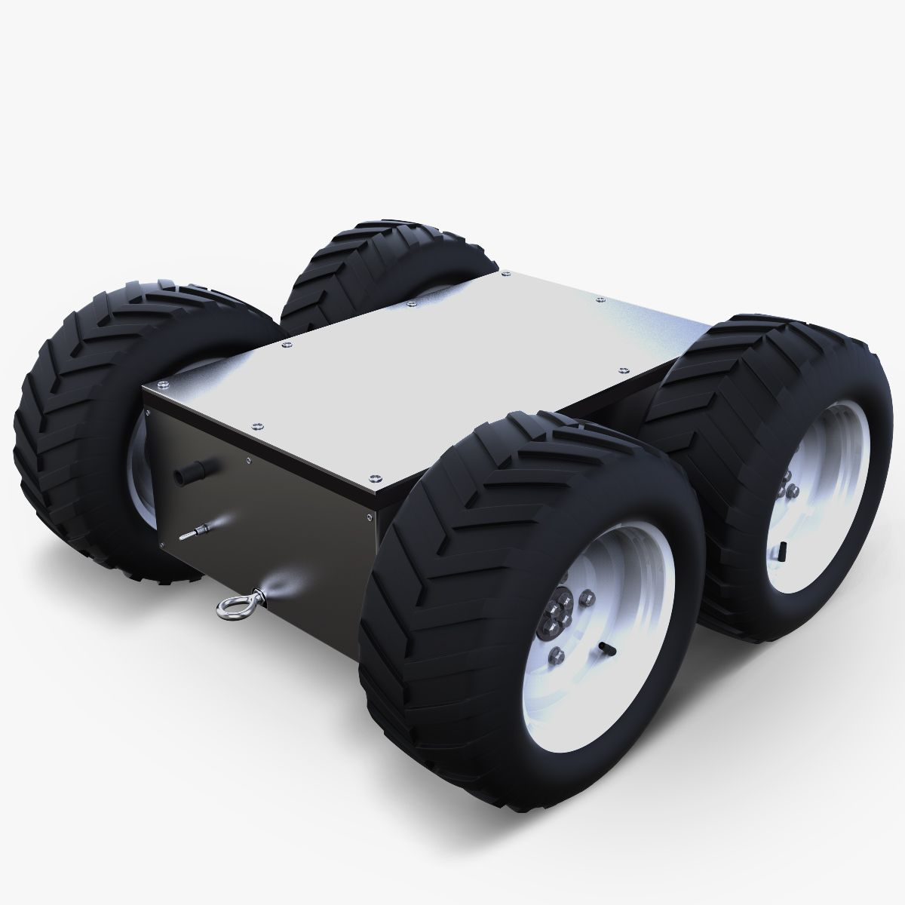

# SmartCart Standalone Simulation

A complete ROS 2 Jazzy + Gazebo Harmonic simulation of an autonomous smart shopping cart platform operating in an expanded supermarket/shopping mall environment with an independently controllable crowd of simulated shoppers and a hybrid **Vision + LiDAR + BLE + Re-ID** customer-following pipeline.



---

## 🚀 Features

- **Expanded Shopping Mall World (26m x 18m):** Realistic environment with a wide central thoroughfare, 4 categorized aisle shelving rows (Produce, Snacks, Dairy, Essentials), dual checkout lanes, promotional kiosks, and structural columns.
- **Multi-Person Crowd Simulation (4 People):** Four simulated shoppers (`/human_1`, `/human_2`, `/human_3`, `/human_4`) with independent namespaces, spawn coordinates, velocity command topics, and pose topics.
- **Interactive Multi-Human Keyboard Teleop:** Select which person to control on the fly (keys `1`, `2`, `3`, `4` or parameter `human_id:=N`) using intuitive WASD / Arrow keys in real-time, with an interactive HUD displaying all people and cart positions.
- **Hybrid Target Selection & Perception (`smartcart_perception`):**
  - **BLE Beacon Proximity (`/ble/customer_tag`):** Customer identity tagging with log-distance path loss RSSI model and proximity categorization.
  - **LiDAR-Camera Depth Fusion:** Cross-correlates camera azimuth angles with 2D LiDAR range returns for centimeter-accurate target positioning without depth cameras.
  - **Re-ID & Occlusion Recovery:** Kalman filter dead-reckoning coasting during temporary occlusions (up to 2.0s) and visual Re-ID re-acquisition.
  - **Nearest-Person Trap Immunity:** Preserves lock on designated customer even when bystanders walk closer to the cart.
- **4WD Skid-Steer UGV Architecture:** Heavy-duty chassis model with brushed aluminum deck, low center-of-mass, 7cm ground clearance, and 4 rugged drive wheels (`gz::sim::systems::DiffDrive`).
- **LiDAR Obstacle Emergency Stop:** 2D Planar LiDAR (360 samples, 10 Hz) monitoring the ±30° front safety sector for automatic emergency stops within 0.60m.
- **Interactive RFID Item Scanner & Billing:** Autonomous RFID product lookup catalog (`Milk`, `Bread`, `Apple`, `Biscuit`), duplicate scan prevention, cart clearing, and live billing.

---

## 📁 Package Architecture

```
smartcart_ws/src/
├── smartcart_description/          # URDF / Xacro model and sensor definitions
│   └── urdf/smartcart.urdf.xacro   # 4WD Skid-steer model, LiDAR, Camera, DiffDrive plugin
├── smartcart_gazebo/               # Gazebo Harmonic world and launch files
│   ├── worlds/smartcart_world.sdf  # 26m x 18m supermarket world with 4 human models
│   ├── models/human/               # Collision-enabled human model
│   └── launch/smartcart.launch.py  # Master launch file (Cart, World, 4 Humans, Perception, Follower)
├── smartcart_perception/           # Hybrid Perception & Tracking package
│   ├── ble_simulator.py            # BLE beacon tag simulator with log-distance RSSI model
│   └── target_selector.py          # LiDAR-Camera fusion, Re-ID tracker, and occlusion state machine
└── smartcart_human/                # Crowd simulation and motion controllers
    ├── human_controller.py         # Reusable namespaced human position controller
    ├── human_teleop.py             # Multi-human keyboard teleoperation with real-time HUD
    ├── follow_controller.py        # Proportional human-follow and LiDAR safety controller
    └── rfid_simulator.py           # Interactive RFID billing and product scanner
```

---

## 🛠️ Build & Installation

Ensure ROS 2 Jazzy and Gazebo Harmonic are installed:

```bash
cd ~/Projects/smartcart_simulation/smartcart_ws
source /opt/ros/jazzy/setup.bash
colcon build --symlink-install
source install/setup.bash
```

---

## 🎮 Running the Simulation

### 1. Launch Master Simulation (Single Command)
```bash
source /opt/ros/jazzy/setup.bash
source ~/Projects/smartcart_simulation/smartcart_ws/install/setup.bash
ros2 launch smartcart_gazebo smartcart.launch.py
```
*(Optional: Run in headless mode without GUI with `headless:=true`)*

### 2. Multi-Human Keyboard Teleoperation (Separate Terminal)
```bash
source /opt/ros/jazzy/setup.bash
source ~/Projects/smartcart_simulation/smartcart_ws/install/setup.bash
ros2 run smartcart_human human_teleop
```

#### 🕹️ Keyboard Controls:
| Key | Action |
|---|---|
| `1` | Select **Human 1** (Central Aisle - Followed Customer) |
| `2` | Select **Human 2** (North Aisle A - Shopper) |
| `3` | Select **Human 3** (South Aisle C - Shopper) |
| `4` | Select **Human 4** (Checkout Area - Customer) |
| `W` / `Up Arrow` | Walk Forward |
| `S` / `Down Arrow` | Walk Backward |
| `A` / `Left Arrow` | Turn Left (Yaw) |
| `D` / `Right Arrow` | Turn Right (Yaw) |
| `Q` / `E` | Strafe Left / Right |
| `Space` / `X` | Stop Active Human |
| `+` / `-` | Speed Up / Slow Down |
| `Ctrl+C` | Exit Teleop |

> **Tip:** You can also launch dedicated teleop instances in separate terminals for individual people:
> ```bash
> ros2 run smartcart_human human_teleop --ros-args -p human_id:=2
> ```

### 3. Launch RFID Item Scanner & Billing (Separate Terminal)
```bash
source /opt/ros/jazzy/setup.bash
source ~/Projects/smartcart_simulation/smartcart_ws/install/setup.bash
ros2 run smartcart_human rfid_simulator
```

---

## 📡 ROS 2 Topics & Interfaces

### Perception & Tracking Topics
| Topic | Type | Description |
|---|---|---|
| `/ble/customer_tag` | `std_msgs/msg/String` | Simulated BLE tag advertisement with RSSI and distance |
| `/target/pose` | `geometry_msgs/msg/Pose` | Estimated 3D position of the tracked customer |
| `/target/status` | `std_msgs/msg/String` | JSON telemetry (`FOLLOWING`, `TEMPORARY_OCCLUSION`, `TARGET_LOST`) |
| `/camera/detections_image`| `sensor_msgs/msg/Image` | Annotated camera feed showing bounding boxes, IDs & HUD |

### Robot & Sensor Topics
| Topic | Type | Description |
|---|---|---|
| `/cmd_vel` | `geometry_msgs/msg/Twist` | Robot velocity commands |
| `/scan` | `sensor_msgs/msg/LaserScan` | 2D Planar LiDAR sensor data |
| `/wheel/odometry` | `nav_msgs/msg/Odometry` | Wheel odometry and robot pose |
| `/camera/image_raw` | `sensor_msgs/msg/Image` | Forward-facing camera feed |
| `/rfid/item` | `std_msgs/msg/String` | Scanned RFID item identifier |

### Crowd Simulation Topics
| Topic | Type | Description |
|---|---|---|
| `/human_1/cmd_vel` | `geometry_msgs/msg/Twist` | Human 1 velocity commands |
| `/human_1/pose` | `geometry_msgs/msg/Pose` | Human 1 world pose (Followed Customer) |
| `/human_2/cmd_vel` | `geometry_msgs/msg/Twist` | Human 2 velocity commands |
| `/human_2/pose` | `geometry_msgs/msg/Pose` | Human 2 world pose (North Aisle Shopper) |
| `/human_3/cmd_vel` | `geometry_msgs/msg/Twist` | Human 3 velocity commands |
| `/human_3/pose` | `geometry_msgs/msg/Pose` | Human 3 world pose (South Aisle Shopper) |
| `/human_4/cmd_vel` | `geometry_msgs/msg/Twist` | Human 4 velocity commands |
| `/human_4/pose` | `geometry_msgs/msg/Pose` | Human 4 world pose (Checkout Area Customer) |
| `/human/pose` | `geometry_msgs/msg/Pose` | Legacy alias for Human 1 pose |

---

## 🧪 Automated Verification & Scenario Tests

1. **Crowd Independence Test:**
   ```bash
   python3 test_crowd_simulation.py
   ```
2. **Hybrid Solution Validation (All 5 Scenarios from SOLUTION.md):**
   ```bash
   python3 test_hybrid_tracking.py
   ```
   Verifies:
   - Scenario 1: BLE customer tag packet reception and RSSI path loss modeling.
   - Scenario 2: Target selection and customer locking.
   - Scenario 3: Nearest-Person Trap (bystander closer than customer, lock preserved).
   - Scenario 4: Occlusion and Re-ID appearance recovery.
   - Scenario 5: End-to-end follow tracking via `/target/pose` and `/cmd_vel`.
